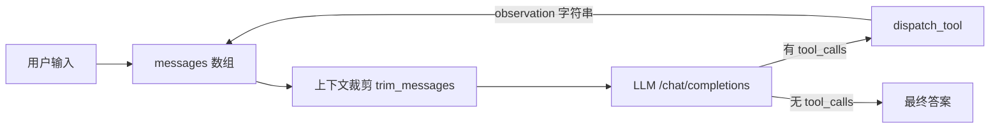

# agent-from-scratch

一个**零第三方依赖**的 ReAct + function calling Agent 运行时，纯标准库实现，核心不到 400 行。

写它的目的只有一个：让你能把「**模型 → 工具调用 → 观测 → 再决策**」这个循环的每一步都看清、改掉、并在面试白板上默写出来。框架会把这段逻辑藏在 `AgentExecutor` 后面，而面试官恰好最爱问这段。

## 为什么不用框架

- 没有 SDK 魔法：HTTP 请求、消息数组、`tool_calls` 解析全部摊开写。
- 没有隐式状态：整条对话就是 `messages` 列表，用调试器一行行走。
- 没有黑盒重复：每一步都记录在 `Agent.steps` 里，可以直接断言。

## 快速开始

```bash
cp .env.example .env          # 改 base_url / model，key 可写在这里或走环境变量
python agent.py "列出当前目录的文件，并计算 (12+8)*3 等于多少"
```

想换成 DeepSeek / 本地 vLLM / 其他兼容端点，只要改 `.env` 里的 `OPENAI_BASE_URL` 和 `MODEL`。

## 架构



一次 `Agent.run()` 的流程：

1. 组装 `system + user` 消息，把工具规格（JSON Schema）一起发给模型。
2. 模型返回 `tool_calls` → 逐个执行工具，把结果作为 `role="tool"` 的消息追加回历史。
3. 模型不再请求工具 → 返回最终答案。
4. 任何一步超过 `max_steps`，或重复调用同一个 (工具, 参数) 组合，就中断并返回错误说明。

## 四个设计要点（面试会被追问的部分）

**1. 工具报错返回字符串，不抛异常。**
`dispatch_tool` 捕获所有异常并转成 `ERROR: ...` 文本。这样模型能在下一步读到自己的错误并自我修正——参数写错、路径不存在、表达式非法都不会让整个任务崩掉。这是"能用的 Agent"和"demo"之间的第一个分水岭。

**2. 裁剪历史时不能拆散 tool_call 和 tool_result。**
`trim_messages` 先把消息按"单元"分组（assistant 的 tool_call + 紧随其后的所有 tool 消息算一个单元），再从最旧的单元开始丢。因为 OpenAI 协议规定：`tool` 消息的 `tool_call_id` 必须能找到对应的 assistant 消息，否则请求直接 400。这个坑在生产里非常常见。

**3. 不用 `eval()` 做计算。**
`safe_calc` 用 `ast` 解析 + 算符白名单。模型输出是不可信输入，`eval("__import__('os').system(...)")` 就是一条 RCE 路径。测试里有对应的反例用例。

**4. 双重终止保护。**
`max_steps` 上限 + 相同 (工具, 参数) 去重。模型陷入循环是 agent 最常见的故障模式，只靠 prompt 说"不要重复"是不负责任的。

## 测试

```bash
python -m unittest discover -s tests -v
```

17 个用例，**全部离线**（用 `ScriptedClient` 假客户端替换真实模型），所以不需要 API Key，可以直接放进 CI：

- 算术求值的安全性（含 `__import__` 注入反例）
- 工具分发：未知工具 / 非法 JSON / 参数错误 / 内部异常 四种失败路径
- 路径逃逸防护（`read_file` 不能读到工作区之外）
- 上下文裁剪不拆散 tool_call 配对
- Agent 循环：调用工具后正确回灌观测、超步数终止、重复调用被识别、失败被回灌

## 上手任务（按顺序做，做完记一次 commit）

| # | 任务 | 验收标准 |
|---|---|---|
| 1 | 把每一步写进 `trace.jsonl`（含时间戳、耗时） | 跑一次任务后能用 `jq` 看出完整决策链 |
| 2 | 支持流式输出（`stream: true` + SSE 解析） | 首字延迟明显下降，且仍支持工具调用 |
| 3 | 加 HTTP 重试：429/5xx 指数退避 | 用假服务器模拟 429 能自动恢复 |
| 4 | 统计 token 与成本，结束时打印汇总 | `run()` 返回值里带上 usage |
| 5 | 多个 tool_calls 并行执行（`asyncio.gather`） | 三个独立工具的总耗时接近最长的一个 |
| 6 | 加长期记忆：历史超长时做摘要压缩而非直接丢弃 | `trim_messages` 被替换为 `summarize_and_trim`，并有测试 |
| 7 | 把 `read_file`/`list_files` 换成真实 MCP server | 工具实现零改动，只换 transport |
| 8 | 加 20 条评测集 + 通过率脚本 | 能输出「v1 通过率 X%，v2 通过率 Y%」 |

任务 6 和任务 8 是面试含量的分水岭：一个证明你会做上下文工程，一个证明你有评测意识。

## 已知限制

- 只支持 OpenAI 兼容的 `/chat/completions`，没有接 Responses API。
- 没有并发控制、没有限流、没有超时预算管理。
- `seen_calls` 去重是全局的，如果某个工具天然需要重复调用（比如 `list_files` 轮询），需要按工具名白名单放行。
- 工具在工作区目录内执行，没有进程级沙箱。

## 下一步

看完这个文件后建议的阅读顺序：`agent.py` 的 `Agent.run` → `dispatch_tool` → `trim_messages`，然后是 `tests/test_agent.py`（测试就是可执行的文档）。